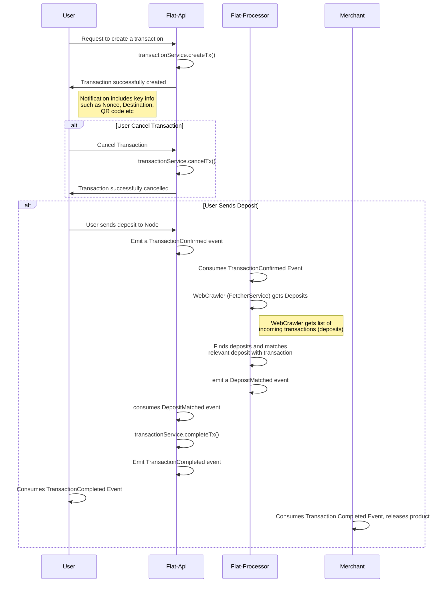
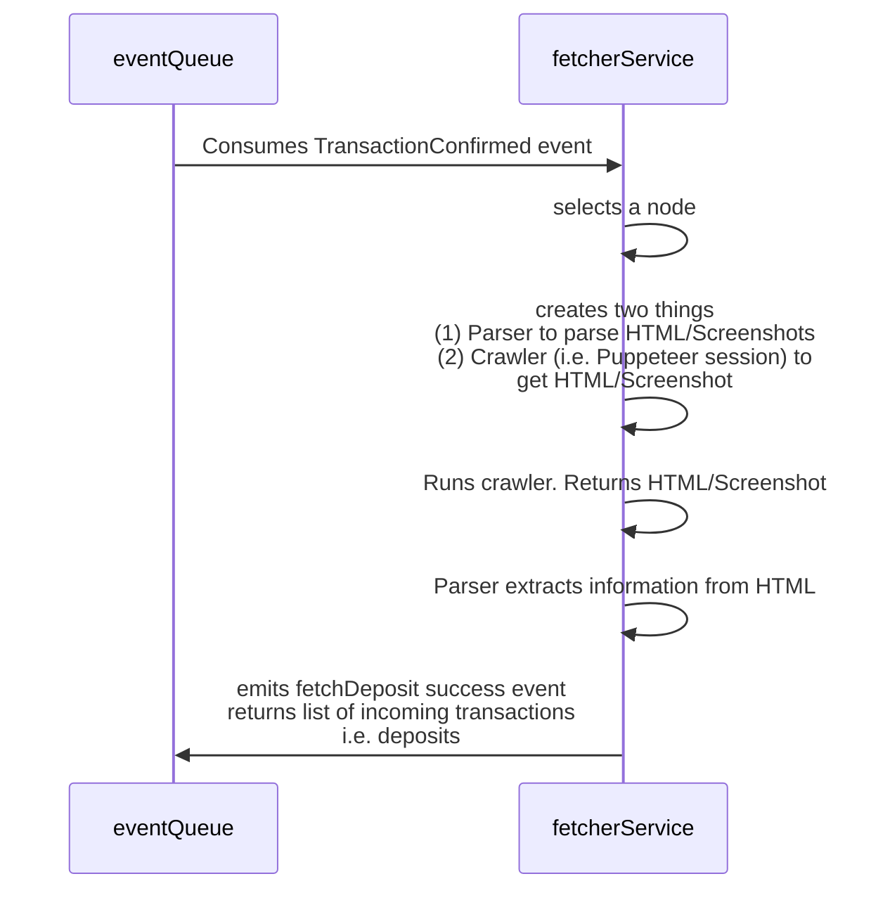

# Transaction Automation (Web Crawling)

# Prompt:

Company XYZ was a payment gateway that used local payment methods to facilitate cross-border transactions.

In order for all this to work, a robust Payment Network was needed to handle the asynchronous processing of transactions (accepting and matching transactions to deposits, updating balances, and sending withdrawals).

Demonstrate your understanding of the overall system architecture and workflow of the payment network. Focus on how the different microservices interacted with each other, how data flowed, and how transactions were automatically processed (Third-Party API, Crawlers). Lastly, demonstrate your understanding of how incoming transactions were matched with deposits and the difficulties that arose here.

As a deep-dive, explain how Web Crawling worked and how you can create a robust, flexible, and easily extendable web crawling system with puppeteer.

# Response

## Requirement Analysis

### Functional Requirements

This covers the basic requirements for the payment gateway to work. It involves a user being able to initiate a transaction, the payment network accepting and processing the transaction, and finally completing the transaction

**Glossary of terms:**

- `User` - refers to someone who wants to use the payment gateway
- `Merchant` - an entity that sells a product or service, uses the payment gateway to process transactions
- `Peer` - refers to someone who owns a node in the system
- `Node` - refers to the bank account that can receive and send transactions
- `Transactions` - refers to an event where money either flows in or out of the network
  - `Deposit` - refers to a transaction where money flows into the network
  - `Withdrawal` - refers to a transaction where money flows out of the network
- `Nonce` - a unique string that users send in the notes of a transaction. It is used for matching

**Flow (for deposits):**

1. `User` wants to purchase a product. They request to make a `deposit`
2. One of our microservices, `Fiat-Api`, receives the request and it creates a `Transaction` using `TransactionService`
3. `Fiat-Api` notifies the user that a transaction has been successfully created. It shares key information (e.g. QR Code for `User` to scan to send payment, Nonce) to inform the `User` about where to send the `Deposit`
4. `User` can either choose to cancel the transaction or proceed with sending the `Deposit` via their local payment method (a `Provider`, e.g. DuitNow, PromptPay) to a `Node` in the payment network.
   1. If `User` has cancelled the transaction, emit a `TransactionCancelled` event. This notifies Fiat-API to set the `Transaction` to the `Cancelled` status.
   2. If `User` sends Deposit (i.e. confirm transaction), proceed to step 5
5. When a Deposit `Transaction` has been confirmed, emit a `TransactionConfirmed` event. This will trigger `Fiat-Processor` to try to find the deposit and match it with the `Transaction` in the database.
   1. `Fiat-Processor` looks at the event and identifies the `Node` that the deposit was sent to. Initiate the `WebCrawler` service to crawl through the `Node`'s account to get a list of `Transactions`. Process the `Transactions` to get the most recent `Deposits` and try to match the `Deposits` (i.e. using a `DepositMatchingService`. Deposits can be matched via Nonce, Amount, Time etc)
   2. Upon successful match, `Fiat-Processor` emits a `DepositMatched` event.
6. `Fiat-Api` consumes the `DepositMatched` event and completes the `Transaction` using `TransactionService`. It also emits a `TransactionCompleted` event to notify both the `User` and the `Merchant` that the transaction was successful. The `Merchant` can then release product (i.e. send the product to the user)

### Non-Functional Requirements

There are many ways to optimise the payment network. Reliability, observability and notification, and extensibility are the key things I will focus on

1. **Reliability** - our payment network should be reliable and be able to continuously accept incoming requests to create transactions. In other words, we can to be able to accept as many deposits as possible from users. To achieve this:
   1. **Asynchronous Handling** - the system should not be hindered by any bottlenecks. For example, deposit matching might be a bottleneck as the transaction could take a while to come in OR the matching service is unable to match the transaction. Thus, we should use event-driven architecture to asynchronously handle the flow, accepting transactions while processing/completing it at a later time.
   2. **FailOver / Increase number of nodes and methods** - a single `Node` as a `Provider` for a method is a single point of failure. If that node fails, the payment network is not able to accept any transactions at all. Similarly, if a method fails (e.g. PayNow is down) and it’s the only method for a currency, it means that no transactions can be created for the currency. Thus, the payment network should strive to have **multiple** `Nodes` for a `Provider` and **multiple** `Methods` for a currency.
2. **Observability and notification** - one of the biggest issues with web crawling is that sites often change. For example, the flow to create a transaction in PayNow might change after 6 months. Thus, it’s important to be **notified** when transactions fail and to know if there are **patterns** and the **point of failure** to quickly identify what needs to change.
   1. **Observability** - having a good logging system will allow you to pin point exactly which stage of the transaction flow has failed. This will increase the speed at which you’re able to correct the flow and enable transactions again
   2. **Notifications** - developers need to be notified if the system encounters errors and for which transactions. While a good logging system helps you debug, developers should be notified in real-time so that they can act immediately. Using services like Slack to create a stream of transactions and to notify developers when a transaction fails is a good way for developers to be notified
3. **Extensibility** as mentioned in failover, it’s important for there to be multiple `Nodes` to service `Providers` and multiple `Methods` to serve a currency. Thus, your system needs to be designed in a way that’s easily extendable. The services should depend on \*\*abstractions\*\* and design patterns like using a **factory method** to select a `Node` to create a transaction with a `Provider` will allow your system to be easily extendable

---

## Architecture

### WebCrawler (FetcherService)

