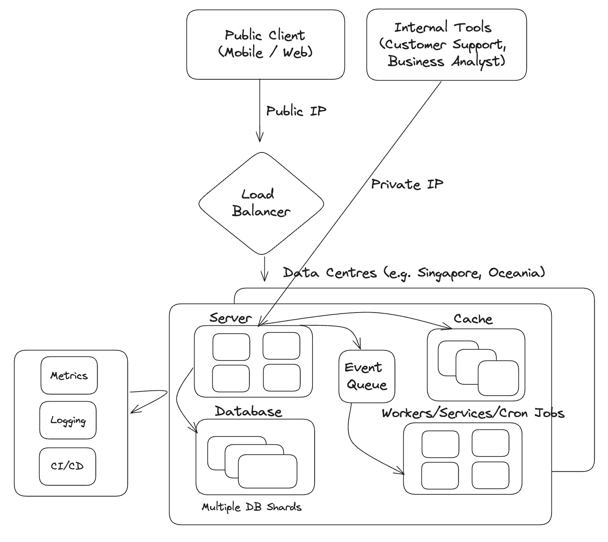
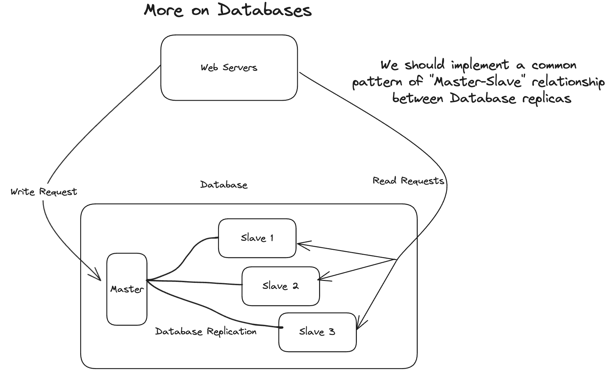
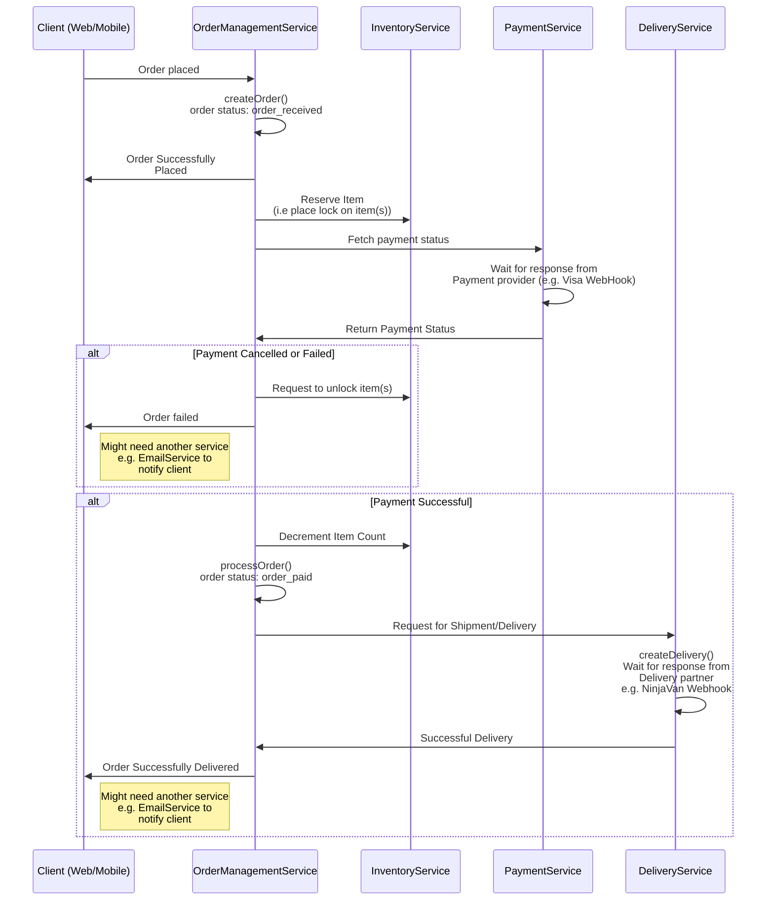

# Order Management System

# Table of Contents

- [Table of Contents](#table-of-contents)
- [Prompt](#prompt)
- [Response](#response)
  - [Requirement Analysis <a name="user-content-RequirementAnalysis"></a>](#requirement-analysis-)
    - [Functional Requirement <a name="user-content-FunctionalRequirement"></a>](#functional-requirement-)
    - [Non-Functional Requirements <a name="user-content-Non-FunctionalRequirement"></a>](#non-functional-requirements-)
  - [Architecture <a name="user-content-Architecture"></a>](#architecture-)
    - [Architecture Diagrams <a name="user-content-ArchitectureDiagrams"></a>](#architecture-diagrams-)
    - [Mermaid Sequence Diagram <a name="user-content-MermaidSequenceDiagram"></a>](#mermaid-sequence-diagram-)
    - [Load Balancing <a name="user-content-LoadBalancing"></a>](#load-balancing-)
    - [Database <a name="user-content-Database"></a>](#database-)
    - [Event Queue <a name="user-content-EventQueue"></a>](#event-queue-)
    - [Cache <a name="user-content-Cache"></a>](#cache-)
    - [Monitoring, Logging, CI/CD <a name="user-content-MonitoringLoggingCICD"></a>](#monitoring-logging-cicd-)
  - [Data Models <a name="user-content-DataModels"></a>](#data-models-)
  - [Interfaces (API) <a name="user-content-Interfaces"></a>](#interfaces-api-)

# Prompt

Order Management Systems (OMS) are a critical component of an e-commerce platform. It’s responsible for handling and processing customer orders efficiently.

The OMS should be able to handle a large number of incoming orders, process them accurately, and provide real-time order status updates to customers. It should also be able to integrate with other systems such as inventory management, payment gateways, and shipping providers amongst others.

Your task is to design a **scalable** and **robust** architecture for the OMS. Focus on the high-level components, their interactions, and the data flow between them. Consider factors such as performance, availability, fault tolerance, and scalability.

# Response

## Requirement Analysis <a name="RequirementAnalysis">

### Functional Requirement <a name="FunctionalRequirement">

This covers the MVP for this system. The flow is described below and the mermaid diagram gives a visualisation of it. In summary, the OMS should be able to receive, process, and complete an order. There will be multiple states (e.g. `Order_Received`, `Order_Paid`, `Order_InTransit`, `Order_Completed`. There might be other states but this is the minimum required for the service to work).

It might also make sense to separate the order management service into `OrderManagementService` which encapsulates managing order state. There’ll be a separate service that handles retrieving order information

**Flow:**

1. OMS receives order, order is created with `createOrder()` and set to a `pending state`
   1. Upon receiving order, OMS calls a service (e.g. `IInventoryService`) to reserve the item. This can be a temporary lock that has a set Time To Live (TTL). Or, if it’s simpler, it decrements the inventory count (and later increments it if order fails/cancelled)
2. OMS listens for events from a payment service (e.g. `IPaymentService`). Payment service provides updates from the payment processor (e.g. VISA, MasterCard, Stripe) and notifies OMS when the item has been successfully paid for.
3. Upon unsuccessful payment (e.g. `Payment_Cancelled` or `Payment_Failure`)
   1. OMS begins `cancelOrder()`
4. Upon successful payment (e.g. `Payment_Success` event), OMS begins `processOrder()`
   1. Update order status from `Order_Received` to `Order_Paid`
   2. Decrement number of items (`IInventoryService`) if not done so already
   3. Emit event to trigger item to be delivered
5. OMS will listen to updates from (`IDeliveryService`). Upon successful delivery, OMS will move the order’s status to `Order_Completed`

### Non-Functional Requirements <a name="Non-FunctionalRequirement">

Non-functional requirements covers optimisation, handling edge cases, and improving the functionality of the OMS service. In the prompt, the key things to keep in mind are **scalability** and **robustness**. This includes:

1. **Load Management** - e-commerce websites will see a spike in traffic and orders during sales season (e.g. Black Friday, 11.11, Christmas). OMS’ system design will need to take this into account and be able to rapidly scale up and scale down servers depending on load
   1. **Asynchronous handling** - we will need to use event-driven architecture so that the services can work asynchronously. This will decouple receiving, creating, and completing orders (i.e. we should be able to receive orders continuously even if creating or completing orders takes time). This brings us to the problem of
   2. **Data consistency** - asynchronous handling of events + database sharding/replicas means that we’ll need a way to ensure data integrity so customers don’t order items that are Out of Stock (OOS)
   3. **Horizontal and Vertical Scaling** - we’ll need horizontal scaling (e.g. sharding, replicas) and vertical scaling especially on Black Friday/11.11 for the **Write (Master) Database**
2. **Geography** - if the application provides service across the world, the application should have multiple data centres to cater to customers that fall into their respective geographic bucket
3. **FailOver** - there should be multiple servers, caches, and databases to ensure that if one server fails, the traffic can be routed to the next best available server.
4. **Internal vs. External facing** - this OMS system might have to differentiate providing services to internal and external users. This might affect the API design (e.g. Parameters passed into methods)
5. **Security + Auditing** - the OMS system should have a single source of truth and an event trail (event sourcing perhaps). Furthermore, access to reading and modifying data should be tiered and have strict entry points (e.g. writing to DB can only be done by servers that are within Private VPN)

---

## Architecture <a name="Architecture">

### Architecture Images <a name="ArchitectureDiagrams">





### Mermaid Sequence Diagram <a name="MermaidSequenceDiagram">



### Load Balancing <a name="LoadBalancing">

The load balancer performs two functions.

1. **Geographic Routing** - it ensures users get routed to the right Data Centre depending on their geographic region. For example, an Australian User’s request will be routed to the Oceania Data Centre.
2. **Server Usage Routing** - it will route a user’s request to the appropriate server depending on the server’s load. Let’s say it’s Black Friday in Singapore. Server 1 might be at 75% capacity while Server 2 might only be at 45% capacity. The load balancer will route traffic from Server 1 to Server 2

### Database <a name="Database">

We can use two strategies from horizontal scaling to try to optimise database performance. During sales season, we want our database to be fault tolerant and have high throughput in order for us to be able to accept the maximum amount of orders (i.e. no orders should be cancelled or carts left at checkout because users can’t make an order)

1. **Sharding** - we should have multiple database shards. Applying a hashing function to a key (e.g. Order UUID) will determine which shard the order gets written to
2. **Replicas** - replicas will let us separate write and read operations (e.g. master-slave relationship). This is especially important during sales season when it is expected that there’ll be many more write (creating order) operations that read operations.

We generally want horizontal scaling because it increases our

1. **Fault tolerance/FailOver** - we want to maximise orders, especially during sales season. So we need more databases to pick up the load if a database fails
2. **Cost effectiveness** (cheaper to scale horizontally than vertically)
3. **High throughput and scalability** - again, we want to maximise orders. Having more databases will allow for more concurrent order creation (throughput)

With that being said, vertical scaling might be relevant for complex querying and calculations. For example, querying from business analysts might require joining several tables and performing aggregations and calculations. Such calculations include calculating Average Basket Size (ABS) and the performance of promotion codes to increase total orders. But this is a more predictable requirement and an SLA can be planned ahead of time between the engineering team and business analyst teams.

### Event Queue <a name="EventQueue">

Asynchronous processing of orders is a good strategy to employ as it allows us to accept orders while taking time later to process the orders.

### Cache <a name="Cache">

Caching is useful to help take some load off the database for read operations.

For example, business analysts might have very common and repeated queries that should be cached so another query and calculation would not need to be made (e.g. Total Orders for Year 2022)

### Monitoring, Logging, CI/CD <a name="MonitoringLoggingCICD">

Monitoring will help the development team be pro-active in managing the health of the different servers. This is crucial as developers should increase/decrease load prior to servers reaching a critical state

Logging will increase the observability of the application and help developers debug much quicker. This is essential during sales season where making changes is time-bound (i.e. you have to fix the bug quickly before Black Friday is over)

CI/CD will quicken developer release cycles and help to roll-back changes if there are any bugs that are released to production. Having good automated testing during build and deployment stages will ensure bugs are caught (granted good testing principles are practiced)

---

## Data Models <a name="DataModels">

This section covers how some data models and states for events will look like. All code is written in TypeScript.

```tsx
export enum OrderStatus = {
	OrderReceived = "order_received"
	OrderPaid = "order_paid"
	OrderInTransit = "order_inTransit"
	OrderCompleted = "order_completed"
}

export type DestinationType = {
	country: string;
	postalCode: string
	address: string;
	phoneNumber: string;
}

export interface IOrder {
  id: string; // UUID
  user: Types.ObjectId // user who ordered. Foreign Key in SQL DB
  items: Array<IItem>
  status: string // OrderStatusType
  currency: string;
  basketSize: number
  destination: Object // DestinationType
  paymentInformation: Object // IPaymentInformation
  promotionCode?: Array<string> | null; // multiple promotion code can be applied
  source: string // App, Web
  notes?: string
  deliveryProvider?: string | null // delivery provider service (e.g. NinjaVan)
  deliveryInstructions?: string | null
  numberOfDeliveryAttempts?: number | null // # delivery attempts
  createdBy: string
  updatedBy: Array<string> // audit trail. Can be edited by user OR customer support
  changeHistory: Array<string> | null
  createdAt: Date;
  updatedAt: Date;
}
```

---

## Interfaces (API) <a name="Interfaces">

This section covers the contracts that are shared between the `IOrderService`, `IPaymentService`, `IInventoryService`, `IDeliveryService`

```tsx
export interface IOrderManagementService {
  /**
   * Creates an order
   * Returns IOrder (status: order_received)
   */
  create(): IOrder;

  /**
   * Confirms an order after receiving successful payment
   * Returns IOrder (status: order_confirmed)
   */
  confirm(): IOrder;

  /**
   * Updates an order based on update args
   * Note: will need to flesh out if updating is required/wanted or
   * if it makes more business sense to get user to create new order
   */
  update(): IOrder;

  /**
   * Cancels an order after cancelled/unsuccessful payment
   * OR upon customer request to cancel
   * Returns IOrder (status: order_cancelled)
   */
  cancel(): IOrder;

  /**
   * Completes an order after receiving successful delivery from IDeliveryService
   * Returns IOrder (status: order_completed)
   */
  complete(): IOrder;
}
```

```tsx
export interface IOrderService {
  /**
   * Retrieves an order based on orderId
   * @param orderId
   */
  order(orderId: string): Promise<IOrder>;

  /**
   * Retrieves an order based on OrderFilterArgs
   * @param filter
   */
  orders(filter: OrderFilterArgsType): IOrder[];
}
```

```tsx
export interface IDeliveryService {
  // Interface that wraps around integration with
  // delivery company(s).

  /**
   * Creates a delivery
   * @param order Receives IOrder (destination, notes etc in order)
   * Returns IOrder with deliveryProvider added in
   */
  createDelivery(order: IOrder): Promise<IOrder>;

  /**
   * Confirms delivery status. Probably a webhook that listens to
   * the delivery provider
   */
  confirmDelivery(): Promise<IOrder>;
}
```
