# Chapter 1 - Scale from Zero to Millions of Users

## Single Server Setup

How would you create an application if it were just meant to serve a single person?

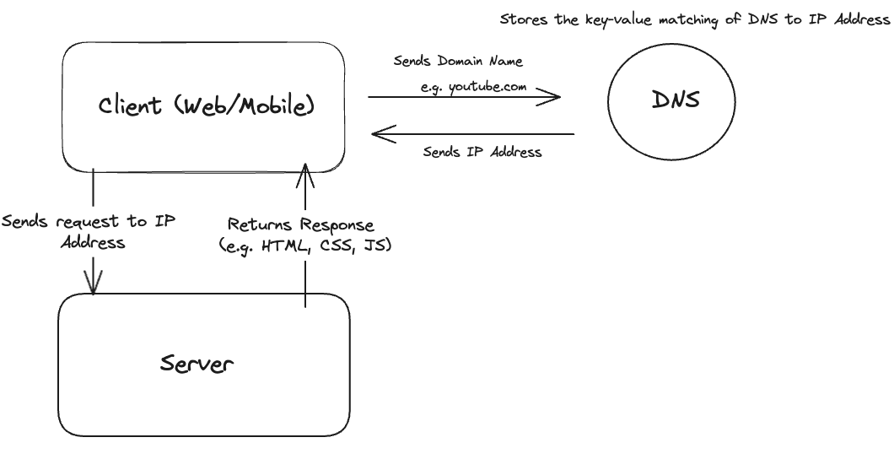

This is a very basic setup that is able to serve a single person

1. The user (client) on either web or mobile wants to visit a website. They enter the domain name into the browser and the DNS (Domain Name System) returns an IP (internet protocol) Address
2. The client then sends requests to the IP address and the server returns the appropriate response (e.g. HTML, CSS, JS, JSON)

---

## Databases

When the number of users grows large enough, you’ll probably want to separate the data layer and the server layer and store data in a database. This allows you to scale the server, client, and database layer appropriately to fit your needs

There are many options to choose from but they fall into two buckets: **relational databases** and **non-relational databases**.

**Relational databases (RDBMS)** store data in a table. The data is represented by rows and they follow a strict schema with each field defined by columns. This is known as **structured** data. One of the most powerful ways to use a relational database is to join tables together using JOIN commands. The database joins tables together using a foreign key

**Non-relational databases** (e.g. MongoDB) store values in different ways. For example, MongoDB stores values as Documents (JSON Objects). Alternative ways to store information would be key-value pairs, graph, and column stores.

For most developers, relational databases make the most sense. They have been used for many years. However, you might want to pick non-relational databases for the following reasons

1. You want super low latency
2. Data is unstructured
3. You only need to serialise and de-serialise data
4. You need to store massive amounts of data → non-relational databases are usually built to scale horizontally

---

## Vertical vs. Horizontal Scaling

Vertical scaling involves scaling up the compute capacity of the server/database/application in question. For example, adding more CPU, memory, or DISK

Horizontal scaling comes in the increase of the number of servers (e.g. nodes, databases)

When traffic is low, vertical scaling is a good option. It’s simple and you can just increase the parameters in the database to increase the compute power. However, there are limitations to this approach

**Limitations to Vertical Scaling**

1. **You will reach a hard cap** - while DBs/Servers can increase compute capacity to a significant amount to solve problems (Stack Overflow services millions of users and requests and it solved it with vertical scaling - it’s SQL DB has 1.5 TB of RAM), you will eventually hit a hard cap of how much more capacity you can add
2. **Diminishing returns** - you will experience diminishing returns with your increase in compute capacity
3. **Does not favour failover or redundancy** - a big problem with relying on one database is that it is a single point of failure. That means that if it fails, your entire website/application goes down

Generally, people look to horizontal scaling rather than vertical scaling for large scale applications.

---

## Load Balancing

A load balancer distributes traffic to servers depending on the settings and preferences that developers have set. There are many different types of methods to distribute requests (e.g. Round Robin, Least Connection, Resource Based (Adaptive)) but the principle is that it helps to distribute load between the servers.

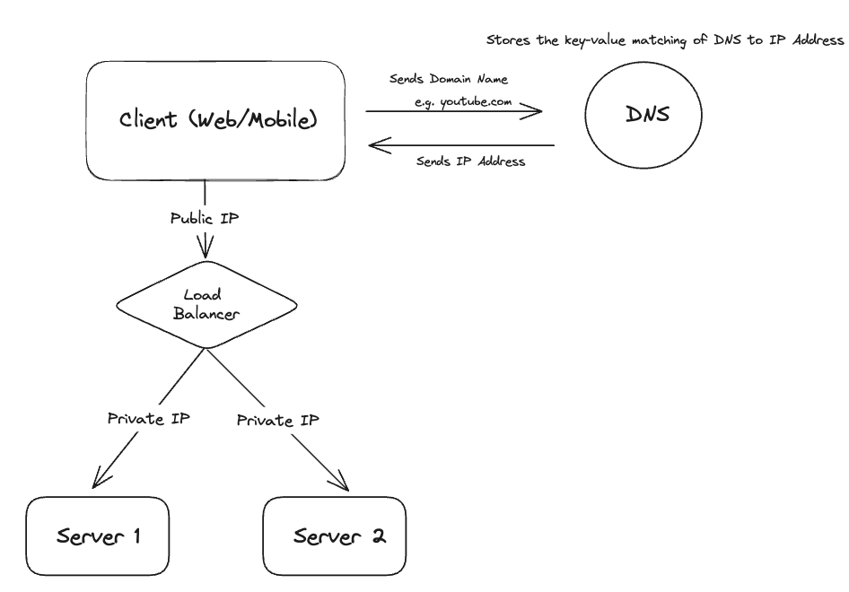

Similar to a basic server, the client sends the domain name to the DNS and receives the **public IP Address**. The client then sends requests to the public IP Address. This is then processed by the **load balancer** and the requests are sent to the relevant servers via **private IP Address**. The server then sends back the response to the client. Note that users cannot reach the servers directly anymore.

Load balancing helps because it allows for:

1. **Failover** - if one server fails, the requests can be sent to the other server while the development team tries to figure out what went wrong with the other server + add more servers if necessary
2. **Availability** - If traffic suddenly explodes, the load balancer can handle this change gracefully by sending out a request to spin up more servers to handle the load

---

## Database Replication

<aside>
💡 “Database replication can be used in many database management systems. Usually with a master/slave relationship between the original”

</aside>

A common and popular technique to structure your replication of databases involves the master-slave pattern. Usually, an application’s database receives **more read requests than write**. Thus, the **master database handles read requests** and any **write requests are sent to the slave databases**.

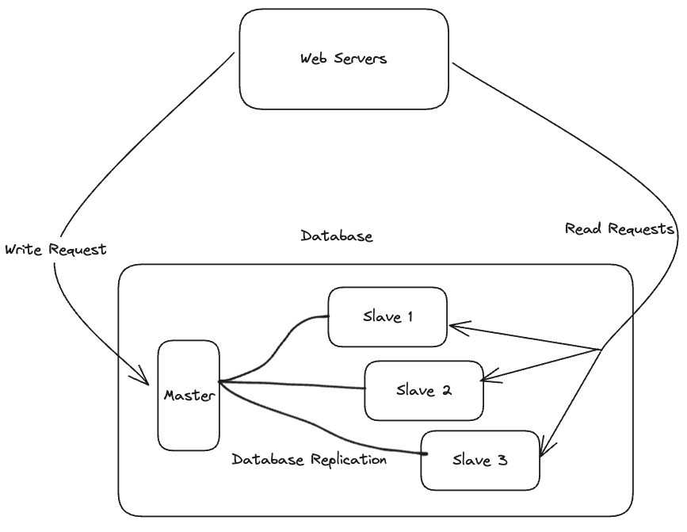

There are several advantages of Database Replication

1. **Better Performance** - splitting up write and read requests now means that they can be done in parallel
2. **Reliability** - If a slave or master database goes down, you’ll be able to route requests to another slave database or even promote a slave to a master database
3. **High Availability** - by replicating databases across different regions, your website remains in operation even if a db goes offline as you can access another database

**What happens when a database goes down?**

1. **If a Slave DB goes down and you only have one** - you can route read traffic to your master temporarily until you fix the problem with the slave DB or spin up another slave DB
2. **If a Master DB goes down** - you can promote a slave to become the master DB. However, there might be some data discrepancies between the master and slave DB as the master DB might have gotten write requests before going down. Thus, you should probably run some **recovery scripts** in order to get the data that has not had the chance of being replicated

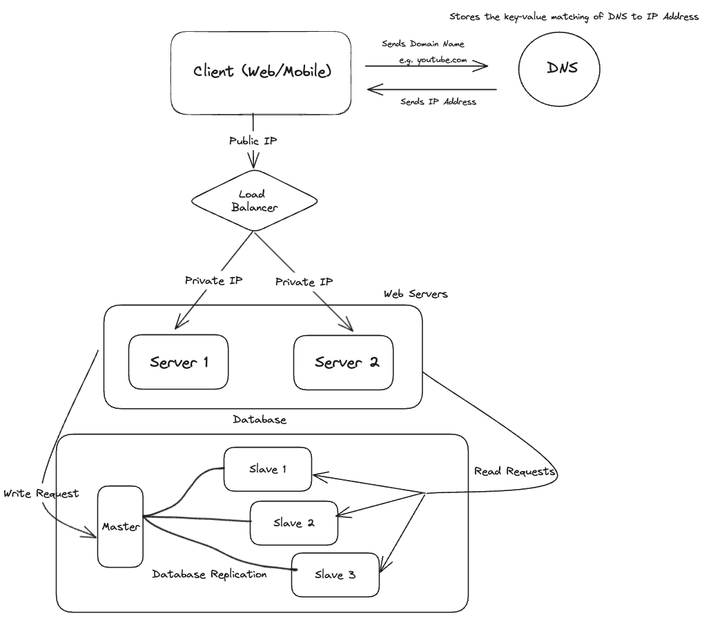
    
    ** Please note that each server makes the read/write request to the database (as opposed to an overarching web server making the request on behalf). I have just not represented that with the arrows to keep the drawing neat
    
    ---
 
 ## Caching - improving load & response time
    
 A **cache is a temporary storage area** that saves data **in-memory**. 
    
 Caching is an important tool for us to improve load and response time. Instead of trying to make requests to the database and awaiting the response, you can instead store the result of a request in a cache. This means that the next time you make a request, the application/server will look at the cache first to see if the information is there and it’ll return it. Subsequent requests will be much faster because accessing cache is super quick since it’s **in-memory**. 
    
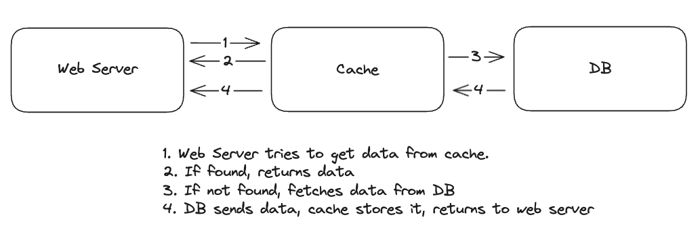
    
This strategy is called **read through cache**
    
There are many considerations you should have when thinking about using caching
    
1. **Nature of accessing data** - you should cache data when it is **read frequently but updated rarely**. If you need to update the data frequently, then it’s likely that the data stored in cache will be out-of-date
2. **Expiration date** - you need to have an agreed upon expiration date that fits your use case. If the expiration date is too late, then you will have a very large cache and incur the costs that are associated with that. If it’s too early, then you’ll end up having to read from the DB a lot
3. **Consistency** - It’s hard to keep cache and DB data up to date and synced. Sometimes cached data will not reflect changes made in the DB
4. **Mitigating Failures** - Caching, like databases, are susceptible to a single point of failure problem. You should provision multiple caches or increase the memory of the cache to ensure you have buffer space and breathing room 
5. **Eviction policy** - once your cache has reached its maximum capacity AND if you have not set an eviction policy, there’s a good chance that you’ll delete data in the cache by writing over it. Thus, you’ll need a good eviction policy to clear the cache of old data. For example, **last recently used** is a popular technique. Other technique include **least frequently used** and **First-in-First-out** 
    
    ---
    
## Content Delivery Network
    
    CDN is a network of geographically dispersed servers to deliver static content. Static content includes HTML, CSS, JavaScript, and media files (e.g. Images, Videos). 
    
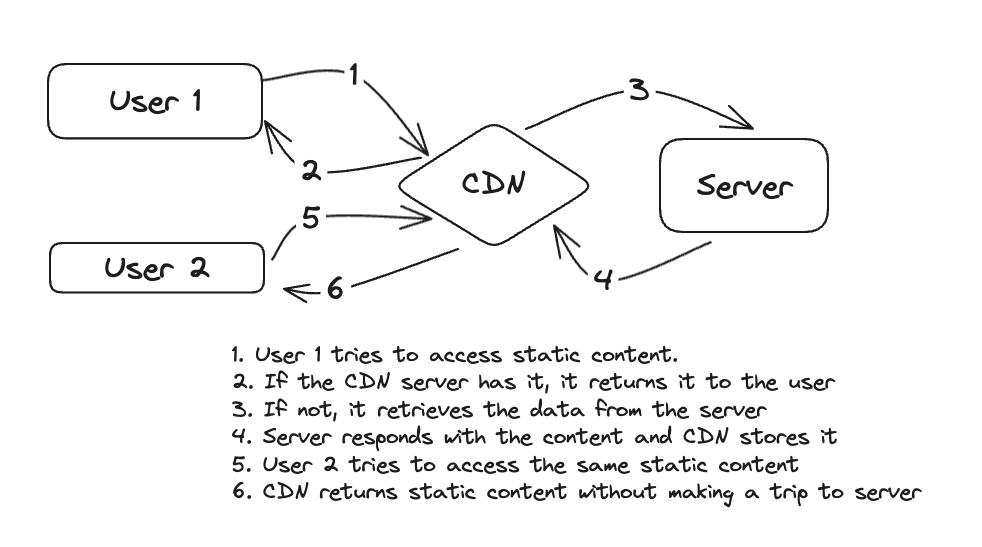
    
There are several considerations you should keep in mind if you would like to use a CDN 
    
1. **Costs** - CDN services are provided by 3rd party providers. It’s important to remember how you’re using it so that you don’t incur extravagant costs 
2. **Cache** - Managing your cache is crucial as if you keep things for too long you might incur higher costs 
3.**Point of Failure** - similar to DBs and Caches, you should keep in mind that CDNs are susceptible to being a single point of failure. A solution is to make sure that the client is still able to retrieve files from the origin/server IF the CDN is down 
4. **Invalidating files** - sometimes what you store in your CDN might be out of date and you need a way to invalidate and refresh the files. 3rd party providers typically provide an API to manage your cache but you can also use versioning of your files 
        
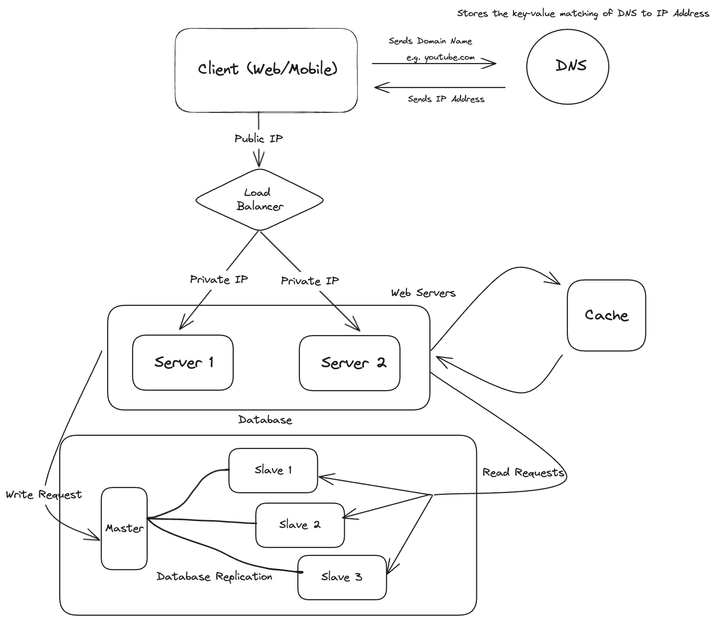

---

## Stateless Web Tier

One of the ways to scale horizontally is **moving state out of the web tier**. For example, a user’s profile and session should not be kept in state. Instead, it should be stored in a DB (this is similar to how REST is stateless, though RESTful APIs encompasses much more than that)

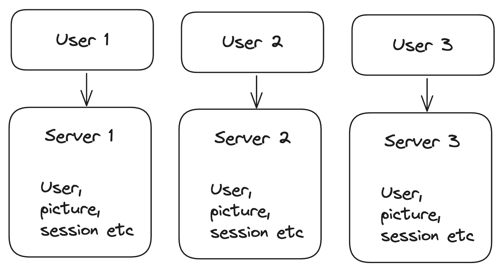

The issue is that if you **coupled the users with a server**, you get a system that isn’t very scalable. For example, if User 1 gets sent to Server 2, their information will not be available and it’ll lead to poor user experience.

On the one hand, you could use**sticky sessions** with load balancers to ensure the User gets routed to the right Server. However, this adds to overhead and increases complexity. For example, it’ll be hard to add or remove servers or handle server failures.

The solution is to have a **stateless architecture** - stateless web architecture involves HTTP reqs being sent to any web server which fetches a shared state in the database. You could use a **NoSql** **DB** to store data.

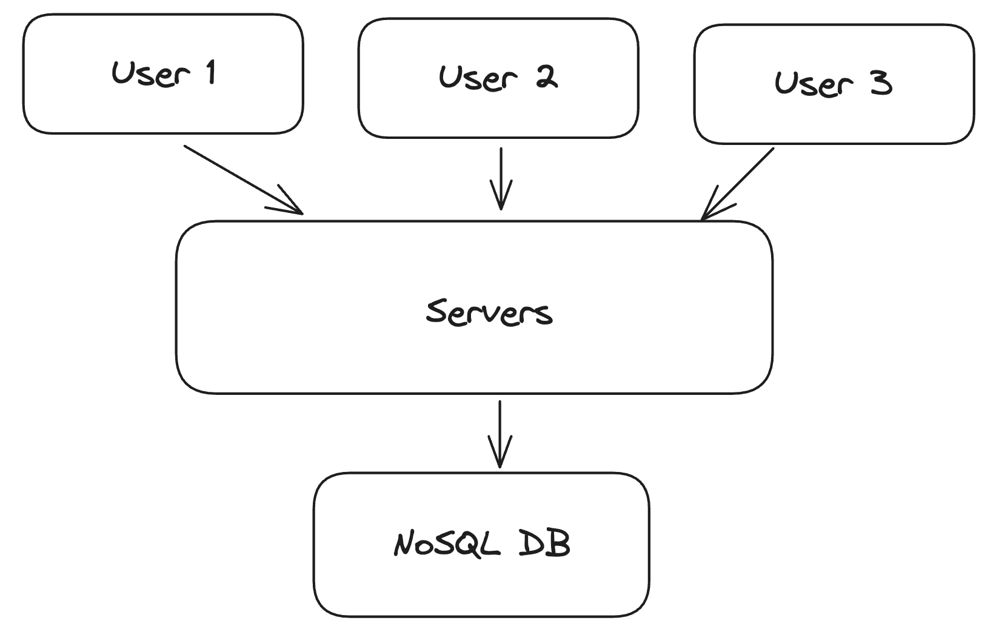

---

## Data Centres

Data Centres wrap around everything past the load balancer BUT not the NoSQL Database and CDN.

Essentially, the idea of data centres is to replicate the server + db + cache layer and categorise them based on geographic region. You’ll then route people to the closest data centre (geographically). For example, if the person’s IP Address is from US East, you’ll route them to the US East data centre.

If a data centre fails, you’ll simply route the traffic to the next closest data centre.

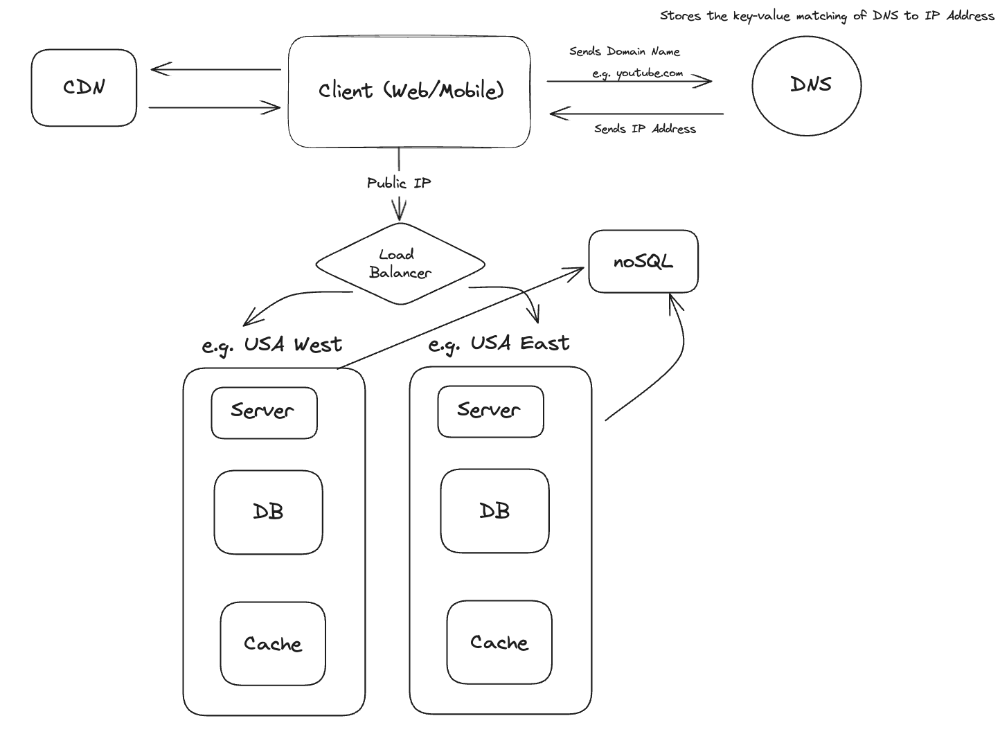

There are multiple challenges to setting up a data centre

1. **Traffic Redirection** - you’ll need to set up tools to ensure that you have good traffic redirection in the case of a data centre failing or being overused. GeoDNS can be used to direct users to their relevant Data Centre based on IP Address
2. **Data Synchronisation** - in the case of a failover, you’ll need to route users to another data centre. However, you’ll also need to ensure that data is consistent across the different data centres (e.g. the different DBs and Caches). You’ll need to implement a method to ensure consistency
3. **Testing & Deployment** - with multiple data centres, it’s important to test your services and apps across the different locations. You’ll probably want automated testing

---

## Message Queues

In order to have better scalability, it’s a good idea to **decouple the services.** This allows you to scale up or down the services depending on their load. This allows you to optimise your costs.

The question is, how will you then communicate across the different services if they’re not in a monolith? The solution is to employ **message queues**. A message queue is a component that is stored in memory that supports **asynchronous communication**.

You have a **message queue** (stores the messages), a **publisher** (produces the messages), and a **subscriber** (consumes the message).

The **pub/sub** model helps you scale because you can handle things asynchronously. For example, the service that publishes does not need to wait for the subscriber to finish their task before publishing their next message/event. If you do not decouple them and are using a **blocking** system, then the publisher would need to wait (bottleneck) for the subscriber to finish before handling the next event.

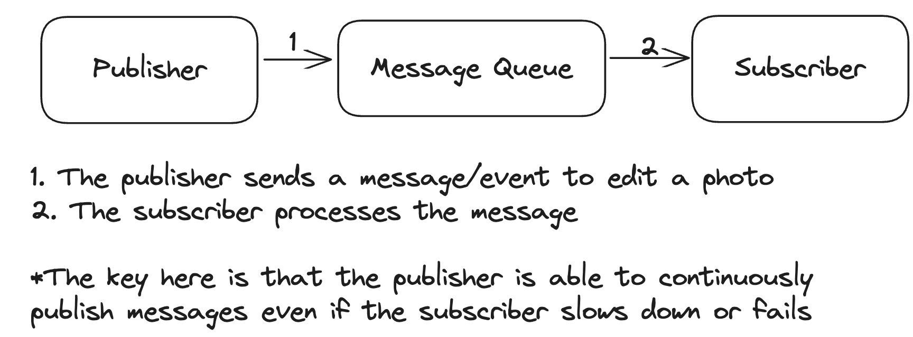

---

## Logging & Metrics & Automation

When working on a small app, infrastructure like logging/metrics/automation are not that important. However, when operating large websites, these tools are vital as they provide **observability** to your application.

- **Logging** - helps you identify errors. This can either be done to monitor error logs at a server level or aggregate them and display them somewhere else (e.g. ElasticSearch)
- **Metrics** - host-level metrics (e.g. CPU, Memory, Disk I/O usage)
- **Automation** - CI/CD

---

## Database Scaling

There are two broad approaches to database scaling. There’s **vertical scaling** (increasing computing power) and **horizontal scaling** (increasing the number of DBs/Nodes).

One way of horizontally scaling is by **sharding** (adding more servers). Data is allocated and added to a shard by a key. You take a key (e.g. the UUID of the entry) and apply a hashing function. This hashing function is used to find the corresponding shard and the data is entered into that shard.

The Sharding/Partition Key is what is used to determine how data is routed and sharded.

There are several things you’ll need to consider when sharding

-**Resharding Data** - if a shard gets overwhelmed and reaches maximum capacity, you’ll need to figure out a way to re-shard the data.

- **Celebrity Problem** - this occurs when too many popular ids all end up in the same shard. For example, imagine you are Twitter and all the celebrities end up in the same shard after the hashing function is applied. That shard is going to get overwhelmed (assume that Celebrities tweet more)
- **Join & De-normalisation** - once a DB has been sharded across multiple servers, it’s hard to join across database shards

---

## Conclusion

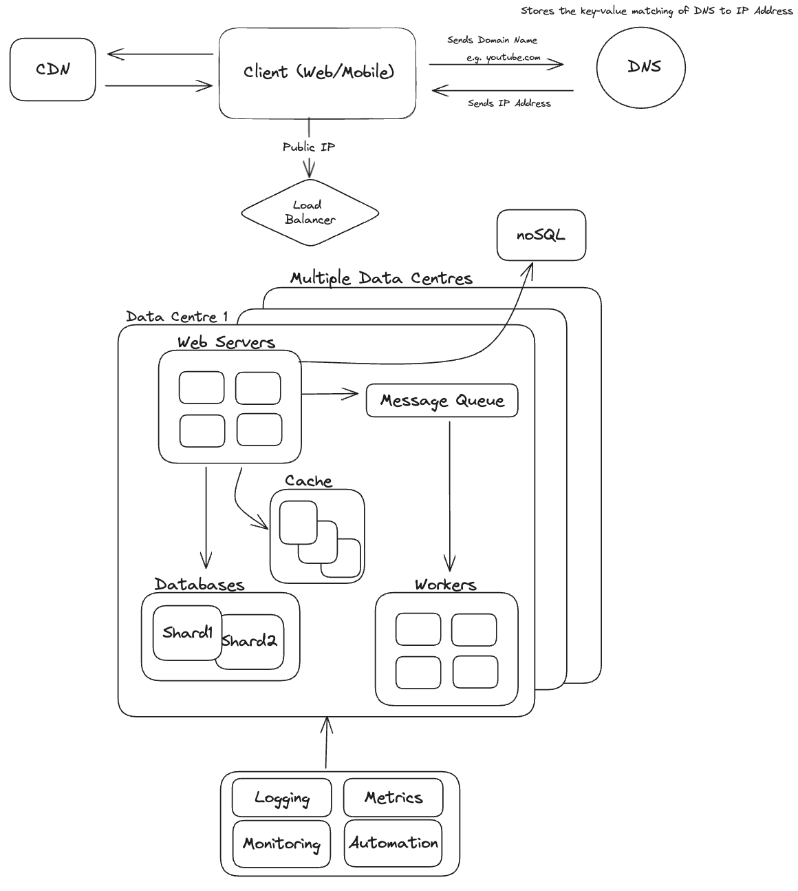
